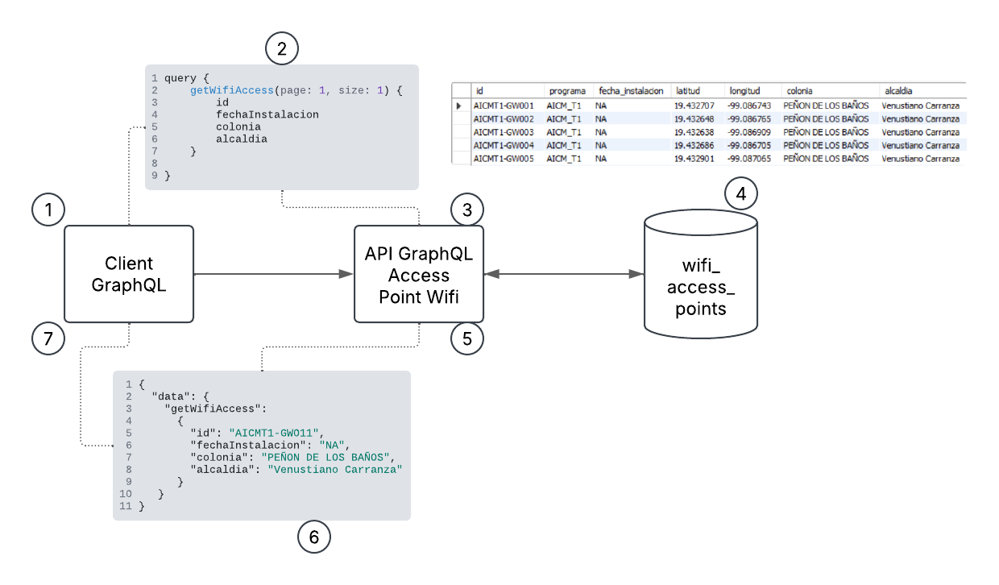

# 📡 Desarrollo de API GraphQL para Puntos de Acceso WiFi en CDMX

## 📌 Introducción

Este proyecto implementa una API GraphQL utilizando Spring Boot para consultar y gestionar información sobre puntos de acceso WiFi en la Ciudad de México. Los datos provienen de un datasource con fuente oficial de registros de localidades y colonias de la Ciudad de México y se almacenan en una base de datos MySQL, con la posibilidad de realizar consultas eficientes por proximidad, por colonia y por ID, considerando ademas tamaño de pagina y registros por cada consulta.

## 📊 Arquitectura General de la Solución

## 📦 Dependencias y Versiones

- Java 8
- Spring Boot 2.7.9
- GraphQL Spring Boot Starter org.springframework.boot:spring-boot-starter-graphql
- Spring Boot Data JPA
- Spring Boot Web
- Srping Boot Starter Jdbc (para establecer comunicacion con la base de datos)
- Spring Boot Starter Test (para pruebas unitarias)
- MySQL Driver
- Docker (para contenedorización de la aplicación y base de datos)

## 🚀 Instrucciones de Despliegue

1️⃣ Clonar el repositorio

    git clone https://github.com/uroblesc/DataPipeline.git
    cd DataPipeLine

2️⃣ Configurar MySQL en Docker

Levanta un contenedor con MySQL ejecutando:

    docker-compose up -d

📌 Nota: El archivo docker-compose.yml debe estar configurado con las credenciales y el esquema necesarios para su despliegue.

3️⃣ Configurar la aplicación

Editar el archivo application.yml en src/main/resources/ con la configuración de conexión a la base de datos.

    spring:
    datasource:
        url: jdbc:mysql://localhost:3306/wifi_access_points?createDatabaseIfNotExist=true&useSSL=false&serverTimezone=UTC
        username: root
        password: P4ssw0rd@
    jpa:
        hibernate:
        ddl-auto: update

4️⃣ Construir y ejecutar la aplicación

    ./gradlew bootRun

## 🛠️ Desarrollo de la Solución

### 📌 Módulos principales

- Modelo de Datos: Entidad AccessPoint con atributos id, colonia, latitud, longitud, etc.

- Repositorio JPA: AccessPointRepository con métodos personalizados para búsqueda por proximidad.

- Servicio: AccessPointService implementa la lógica de negocio para consultas eficientes.

- Controlador GraphQL: AccessPointGraphQL define los queries disponibles en la API.

- Pruebas Unitarias: Implementadas con JUnit y MockMvc.

### 🔍 Consultas de ejemplo en GraphQL

#### Busqueda General
##### 📌 Nota: Importante agregar los paramtros de tamaño y pagina dado que son paramtros forzosos.

    query {
        getWifiAccess(page: 1, size: 10) {
            id
            fechaInstalacion
            colonia
            alcaldia
        }
  
    }

#### Busqueda por Proximidad

    query {
        getWifiAccessByProximity(lat: 19.43, lon: -99.13, page: 1, size: 10) {
            content {
                id
                fechaInstalacion
                colonia
                latitud
                longitud
                alcaldia
            }
        }
    }

#### Busqueda por Colonia

    query {
        getWifiAccessByColonia(colonia: "CENTRO", page: 1, size: 10) {
            content {
                id
                fechaInstalacion
                colonia
                latitud
                longitud
                alcaldia
            }
        }
    }

📌 Autor: Uriel Jafet Robles Cruz

📅 Fecha: 18 de Febrero de 2025